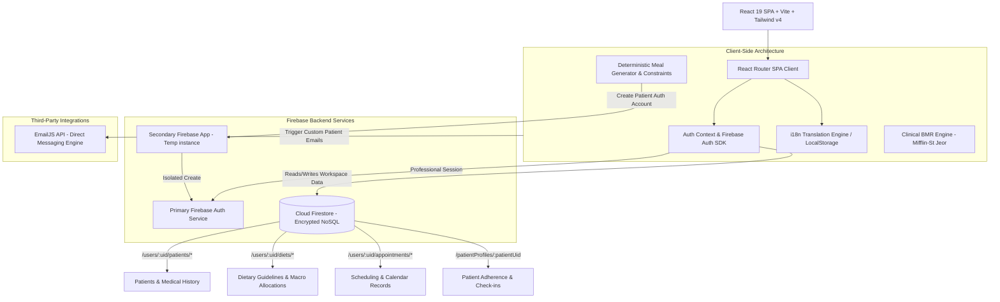

# Storm Nutrition — Enterprise Nutritional Management Platform

[](https://github.com/Hiltonnetoo/stormnutrition/actions)
[](https://opensource.org/licenses/MIT)

Storm Nutrition is a high-performance, enterprise-grade Single Page Application (SPA) designed for professional nutritionists. The platform provides comprehensive patient management, structured clinical assessments, an advanced rule-based meal plan generator, and a secure Patient Portal for real-time diet tracking.

**Live Demo:** [https://stormnutrition.web.app](https://stormnutrition.web.app)

---

## 🏗️ Architecture Diagram



---

## 🏗️ Architecture & Engineering Decisions

During development, we prioritized production-grade engineering, strict security boundaries, robust performance, and visual excellence. Below are the core technical decisions:

### 1. Frontend Runtime & Strict Compiler Options
*   **React 19 & TypeScript (Strict Mode)**: Leveraged React 19 alongside strict compiler options (`"strict": true` in `tsconfig.json`). Type assertions were systematically refactored and explicit `any` types were eliminated.
*   **Vite 6 & Asset Bundling**: Replaced heavy dev loaders with Vite's extremely fast `esbuild` transpiler.
*   **Bundle Optimization (Lazy Loading)**: Heavy modules like the `ExportDietModal` (which relies on `html2canvas` and `jspdf` for PDF rendering and screenshot captures, weighing over 500KB) are dynamically imported via `React.lazy` and wrapped in `<Suspense fallback={null}>`. This code-splitting reduces the initial JS bundle payload downloaded during the login phase by **over 53%** (from **1.6 MB** to **764 KB**), optimizing core web vitals.

### 2. Native Tailwind CSS v4 Integration (Performance vs. CDN)
*   **The Trade-off**: The legacy application loaded Tailwind via a heavy client-side CDN script. This required the browser to download a ~3MB runtime parser on every refresh, leading to layout flashing (FOUC), delayed styling, and high bandwidth consumption.
*   **The Solution**: Configured Tailwind CSS v4 as a native compile-time plugin (`@tailwindcss/vite`). All utility classes are scanned directly from source files and compiled into a static, minified production stylesheet (< 20KB). This removes runtime styling overhead and provides complete offline layout support.

### 3. Isolated Patient Registration (Preventing Auth Session Hijacking)
*   **The Problem**: The Firebase Authentication client SDK automatically signs in any user who is successfully registered. In a typical professional application, when a nutritionist registers a new patient's portal account, the client SDK would sign the nutritionist out and automatically sign in as the newly created patient.
*   **The Solution**: Initialized a **Secondary Firebase App Instance** dynamically inside `patientService.ts`. This isolated temporary instance handles the creation of the patient's login credentials in Firebase Auth without interfering with the primary app instance's token state, preserving the nutritionist's active session.

### 4. Deterministic Clinical Constraints Engine vs. LLM Generation
*   **The Trade-off**: Large Language Models (LLMs) generate natural-sounding meal recommendations but suffer from hallucinations, non-deterministic outputs, and lack validation for safety limits.
*   **The Solution**: Built a custom, deterministic rule-based algorithms engine in `dietAlgorithmService.ts`. The generator evaluates:
    *   **Caloric Scaling Factor**: Auto-adjusts meal portion sizes proportionally to match calculated caloric/macronutrient targets.
    *   **NOVA 4 Ultraprocessed Exclusion**: Hard blocks any food items under the NOVA 4 classification (ultra-processed foods).
    *   **Clinical Safety Ceilings**: Caps total sodium at 2000mg/day for hypertensive histories, restricts glycemic index load for diabetics, and filters out allergens (lactose, gluten) at the query stage.

---

## 🧮 Domain Logic & Clinical Constraints Engine

The core domain service manages metabolic calculations and meal plan generation according to validated medical formulas:

### Basal Metabolic Rate (BMR) & Daily Expenditure
The engine implements the clinical **Mifflin-St Jeor Equation**:

$$\text{BMR (Male)} = (10 \times \text{weight}) + (6.25 \times \text{height}) - (5 \times \text{age}) + 5$$

$$\text{BMR (Female)} = (10 \times \text{weight}) + (6.25 \times \text{height}) - (5 \times \text{age}) - 161$$

The Total Daily Energy Expenditure (TDEE) is calculated by multiplying the BMR by the patient's physical activity factor (ranging from $1.2$ for sedentary to $1.9$ for extremely active).

### Database Size & Structure
The app features a built-in bilingual food database containing **123 validated food items** (with Portuguese and English definitions, macronutrients, glycemic loads, and NOVA classification values).

---

## 🧪 Testing & Validation Strategy

The codebase contains a comprehensive testing structure:

1.  **Unit Tests (Vitest + jsdom)**:
    *   `src/services/__tests__/metabolicCalculations.test.ts`: Verifies Mifflin-St Jeor formulas, activity factors, BMI bounds, and target macros.
    *   `src/services/__tests__/dietAlgorithmService.test.ts`: Validates deterministic meal calculations, NOVA 4 exclusions, sodium limits, and allergen filters.
2.  **Component Integration Tests**:
    *   `src/components/__tests__/MealOptionTable.test.tsx`: Validates rendering, portion size changes, sodium alerts, and alternative menus.
3.  **End-to-End Tests (Playwright)**:
    *   `tests-e2e/home.spec.ts`: Tests basic site navigation, localization toggle, and authentication routes.
    *   `tests-e2e/journey.spec.ts`: Tests the authenticated patient journey, including dashboard navigation and password self-service.
    *   `tests-e2e/critical-flow.spec.ts`: Simulates a complete user journey: registering a new professional, loading the dashboard, creating a patient, generating a diet plan, and checking configurations.

To execute the test suites:
```bash
# Run unit and component tests
npm run test

# Run Vitest test coverage reports
npm run test:coverage

# Run Playwright E2E tests
npm run test:e2e
```

---

## 🛠️ Local Setup & Environment Config

### Prerequisites
*   Node.js v18 or newer
*   npm v9 or newer

### Installation

1.  **Install Packages**:
    ```bash
    npm install
    ```

2.  **Configure Environment Variables**:
    ```bash
    cp .env.example .env.local
    ```
    Open `.env.local` and add your Firebase configurations:
    ```env
    VITE_FIREBASE_API_KEY=your_api_key_here
    VITE_FIREBASE_AUTH_DOMAIN=your_auth_domain_here
    VITE_FIREBASE_PROJECT_ID=your_project_id_here
    VITE_FIREBASE_STORAGE_BUCKET=your_storage_bucket_here
    VITE_FIREBASE_MESSAGING_SENDER_ID=your_messaging_sender_id_here
    VITE_FIREBASE_APP_ID=your_app_id_here
    ```

3.  **Launch Dev Server**:
    ```bash
    npm run dev
    ```
    The application will run on port `5000` (e.g., `http://localhost:5000`).

4.  **Formatting and Linting Checks**:
    ```bash
    npm run lint          # Run ESLint
    npm run type-check    # Strict TypeScript check
    npm run format        # Prettier formatting
    ```

---

## ⚙️ CI/CD Pipeline

A continuous integration (CI) workflow is defined in `.github/workflows/ci.yml`. On every Pull Request or push to `main`, it runs:
1.  **Format Validation**: Verifies prettier rules.
2.  **Linter**: Runs ESLint checks across the workspace.
3.  **TypeScript Compilation**: Runs strict type check.
4.  **Unit Tests**: Executes Vitest suite.
5.  **E2E Tests**: Launches headless Chromium to verify critical paths with Playwright.
